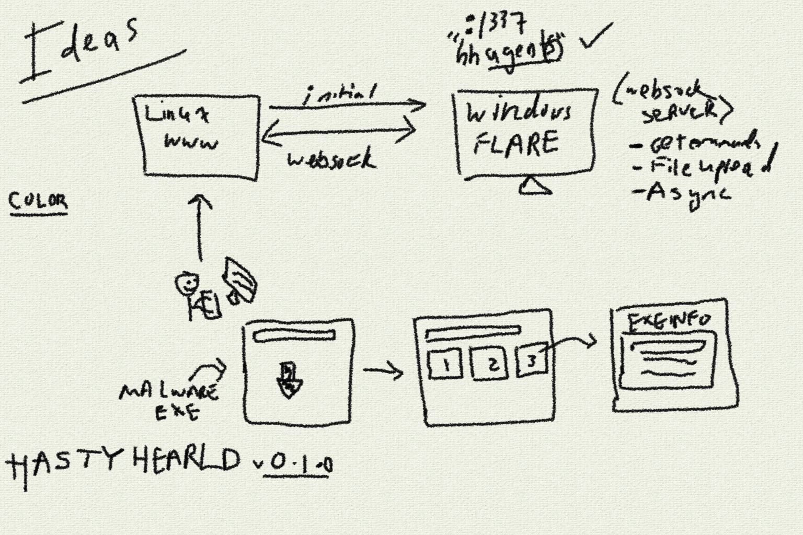

# HASTYHERALD

This is a WIP automated static malware analysis tool for Windows GUI tools. We're creating it live on Twitch currently: https://www.twitch.tv/cyb0rgsecur1ty

## hhagent

Windows agent and websocket orchestration server for automated malware analysis using GUI tools.

* Redis installed

## hhfrontend

Frontend interface for HH, select malware analysis tools to run automatically on the FLARE VM. Get malware analysis feedback.

## TODO

* [x] Automatic frontend deployment to Linux
* [x] Automatic agent deployment to Windows (fabric & openssh)
    * https://github.com/PowerShell/Win32-OpenSSH/releases
    * http://www.fabfile.org/
* [x] Connect to hhagent from the frontend (testing)
* [x] List a few malware analysis GUI tools to display on frontend
* [ ] Launching a test GUI tool (exeinfoPE)
* [ ] Figure out file upload/download for websocket
    * JSON payload -> binary -> base64 (images)
    * Screenshots and artifacts (classes)
* [ ] Display results on frontend
* [ ] Support malware upload on frontend

## Moonshot (longterm TODOs)

* Multi-user (effects on redis)
* Support more than one Windows FLARE VMs (multiple agents)
* Rich plugin infrastructure (for hhagent to create tool support)

# Misc notes

* Tools running in threads need to report they are finished.